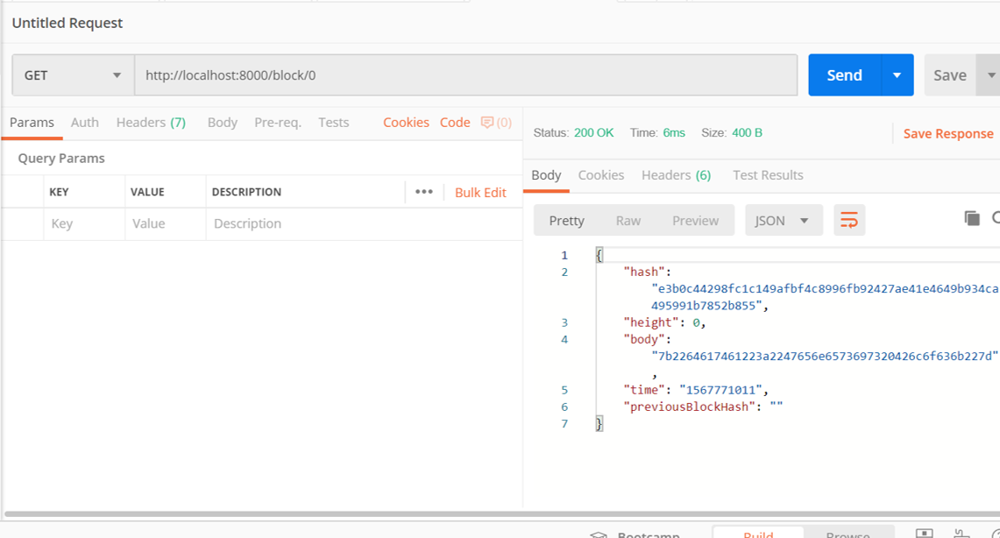
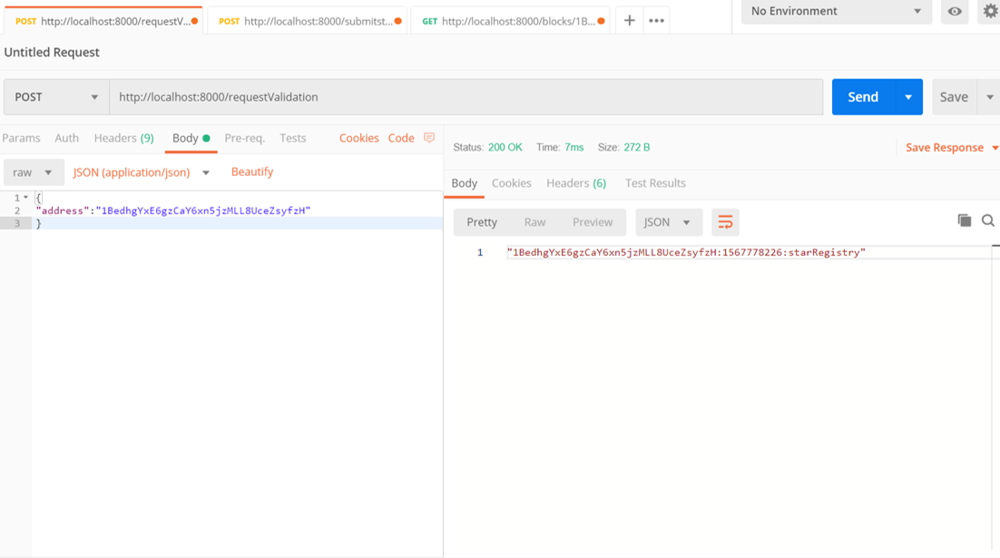
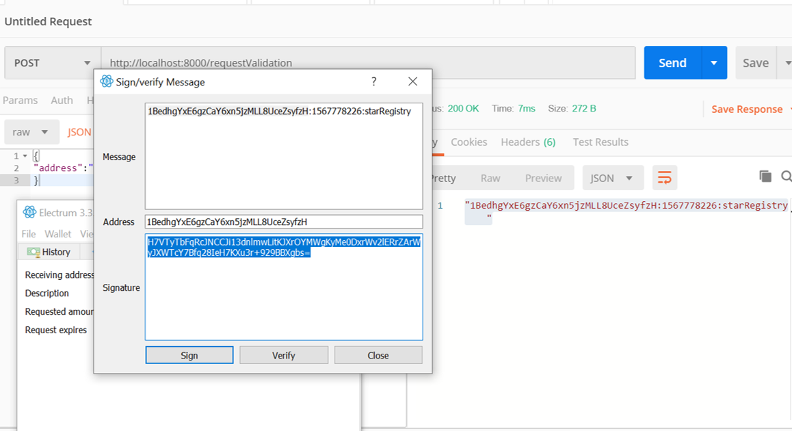
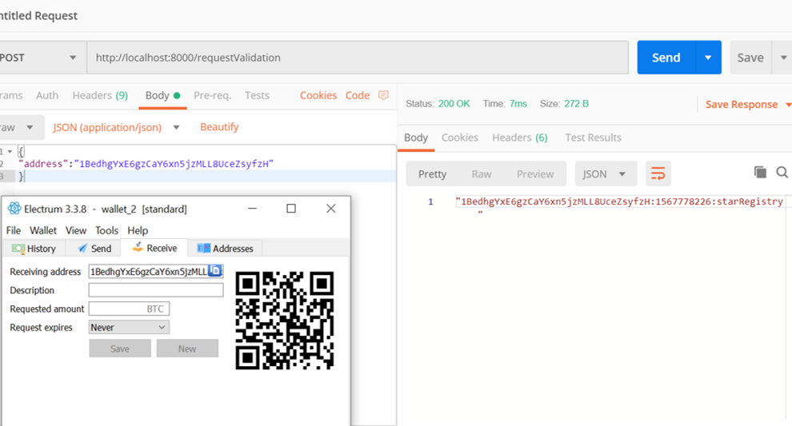
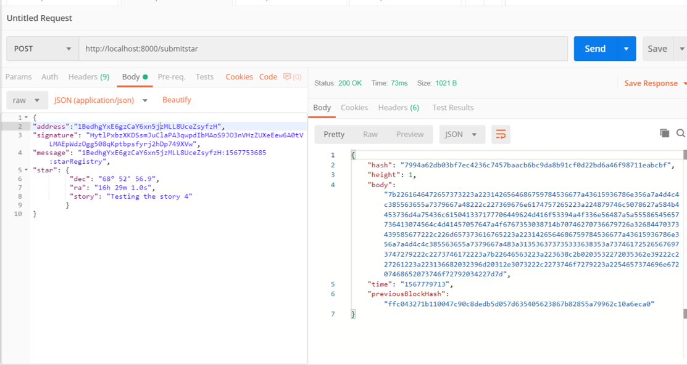
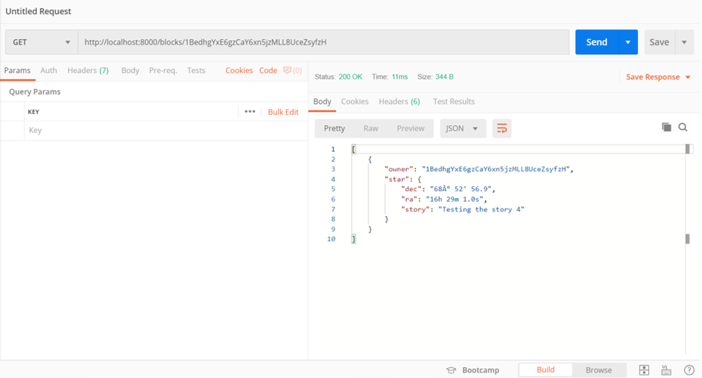

**Udacity Blockchain Developer Nanodegree**

**Project 1: Build Your Private Blockchain**

1.  As per <https://knowledge.udacity.com/questions/45817>, block -\>
    blockHash to differentiate between the requests

2.  must use a GET call to request the Genesis block\
    

3.  must use a POST call to requestValidation\
    
4.  must sign message with your wallet\
    
    
5.  must submit your Star\
    
6.  must use GET call to retrieve starts owned by a particular address\
    
=======
**Udacity Blockchain Developer Nanodegree**

**Project 1: Build Your Private Blockchain\
\
**

1.  As per <https://knowledge.udacity.com/questions/45817>, block -\>
    blockHash to differentiate between the requests

2.  must use a GET call to request the Genesis block\
    

3.  must use a POST call to requestValidation\
    
4.  must sign message with your wallet\
    
5.  must submit your Star\
    
6.  must use GET call to retrieve starts owned by a particular address\
    
>>>>>>> 69a438bb375d33c0c3a30308a9bf79d5f6c8bf09:README.md
