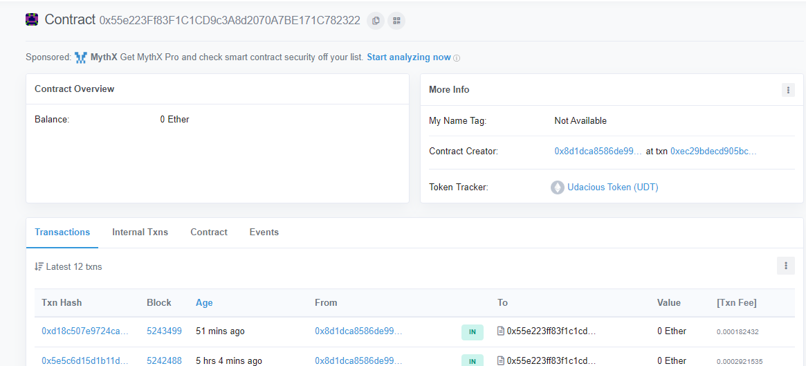
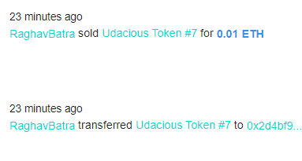
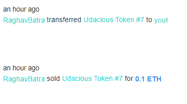

# Udacity Blockchain Capstone

The capstone will build upon the knowledge you have gained in the course in order to build a decentralized housing product.

## Quick Start Deploying to Ganache and Testing

1. `cd` into project repository (`eth-contracts`):

        `cd Blockchain-Capstone-Real-Estate-Marketplace`
        `npm install`

2. Compile Contracts
        `truffle compile`

1. Start ganache (CLI or GUI)
            `ganache-cli`

2. Mirgrate locally
              `truffle migrate --network development --reset`

#### Testing contracts

Testing ERC721
File: TestERC721Mintable.js
Test minting functionality of tokens and transfer of tokens.

    `truffle test ./test/TestERC721Mintable.js`

Test zkSnarks
File: TestSquareVerifier.js
Verifies zkSnarks is successfully implemented.

    `truffle test ./test/TestSquareVerifier.js`

Testing ERC721 token with zkSnarks
File: TestSolnSquareVerifier.js
Test minting with zkSnarks.

    `truffle test ./test/TestSolnSquareVerifier.js`

---

## Quick Start Deploying to Rinkeby

1. Make a new project with Infura

    Infura: `https://infura.io`

2. Setup `truffle-config`

    2.1 set infuraKey
    2.2 set mnemonic from Metamask within `HDWalletProvider`
    2.3 set Rinkeby endpoint within `HDWalletProvider`

3. Migrate to Rinkeby
        `truffle migrate --network rinkeby`

4. Finding ER721 token on EtherScan (contract address)
  https://rinkeby.etherscan.io/token/0x55e223Ff83F1C1CD9c3A8d2070A7BE171C782322

  

5. Minting tokens
  https://www.myetherwallet.com/interface/interact-with-contract

6. Finding tokens on Rinkeby OpenSea
  https://rinkeby.etherscan.io/token/0x55e223Ff83F1C1CD9c3A8d2070A7BE171C782322/1

7. Viewing Token Storefront on OpenSea
 https://rinkeby.opensea.io/assets/udacious-token

## Buying tokens
Udacious Tokens **#6-10** have been bought - this can be checked in the transaction
history for these tokens. See screenshot below for both buyer and seller:

*SELLER:*

*BUYER:*

## Contrct ABI
In same folder as README; present as a JSON file

## Project Resources

* [Remix - Solidity IDE](https://remix.ethereum.org/)
* [Visual Studio Code](https://code.visualstudio.com/)
* [Truffle Framework](https://truffleframework.com/)
* [Ganache - One Click Blockchain](https://truffleframework.com/ganache)
* [Open Zeppelin ](https://openzeppelin.org/)
* [Interactive zero knowledge 3-colorability demonstration](http://web.mit.edu/~ezyang/Public/graph/svg.html)
* [Docker](https://docs.docker.com/install/)
* [ZoKrates](https://github.com/Zokrates/ZoKrates)
