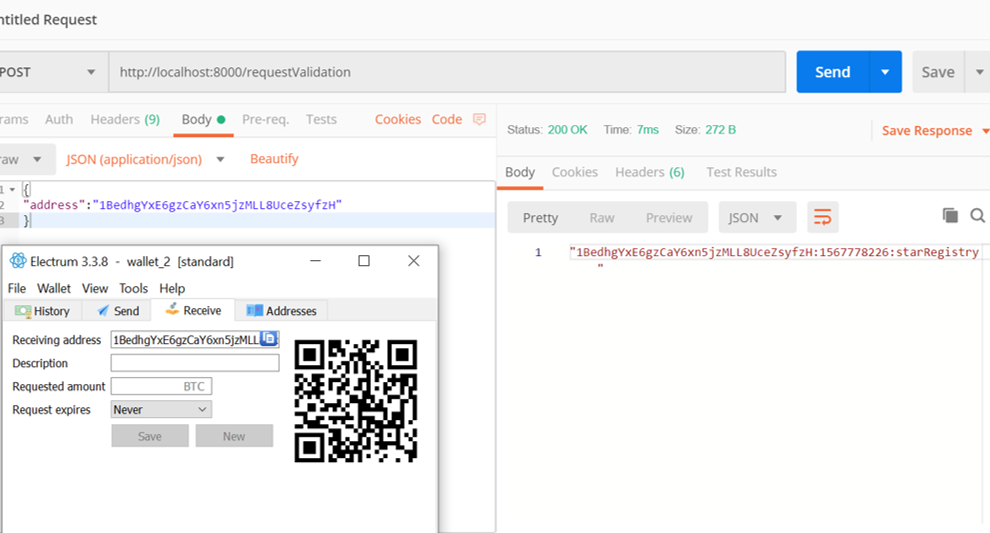

**Udacity Blockchain Developer Nanodegree**

**Project 1: Build Your Private Blockchain\
\
**

1.  As per <https://knowledge.udacity.com/questions/45817>, block -\>
    blockHash to differentiate between the requests

2.  must use a GET call to request the Genesis block\
    {width="4.645833333333333in" height="2.5in"}

3.  must use a POST call to requestValidation\
    {width="4.854166666666667in"
    height="2.7083333333333335in"}

4.  must sign message with your wallet\
    {width="4.666666666666667in"
    height="2.5277777777777777in"}\
    {width="4.604166666666667in"
    height="2.4722222222222223in"}

5.  must submit your Star\
    {width="4.868055555555555in"
    height="2.5902777777777777in"}

6.  must use GET call to retrieve starts owned by a particular address\
    {width="4.861111111111111in"
    height="2.5555555555555554in"}
